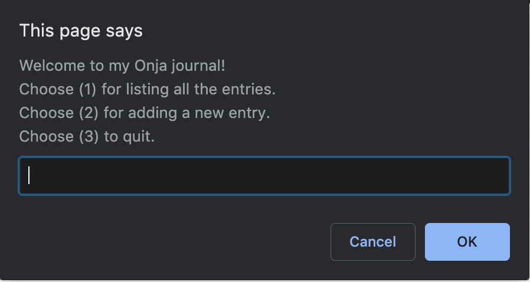
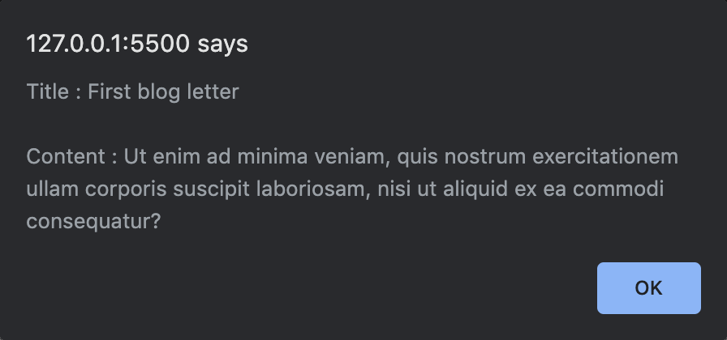
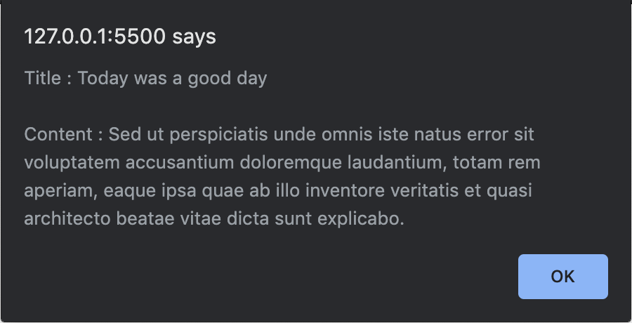
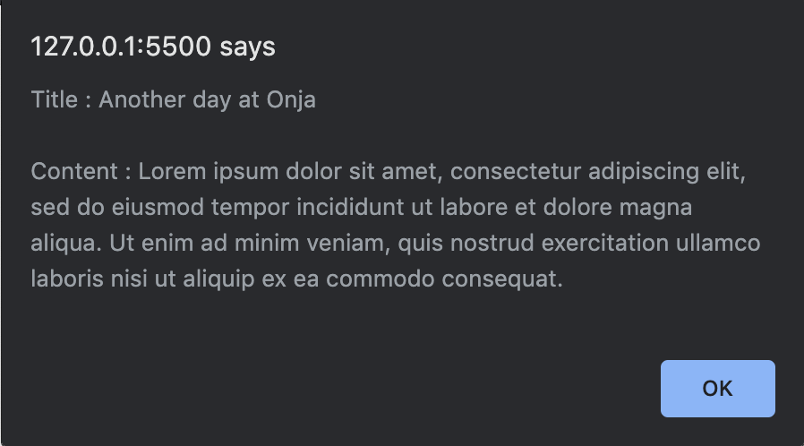
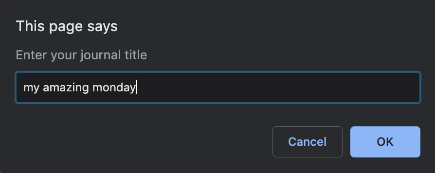
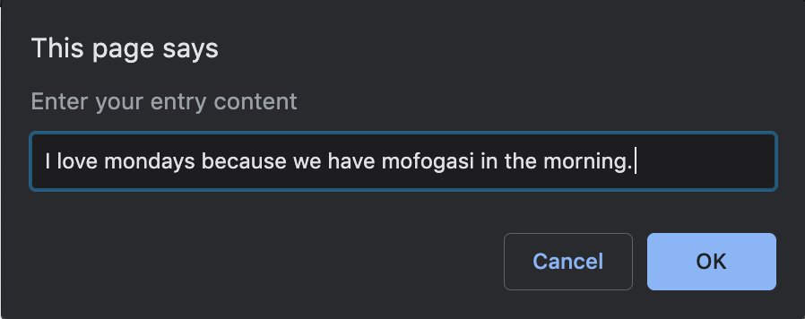

# Onja Javascript Project 2 : Code a simple journal program

To get a better hands on practice in JavaScript, try to implement a simple journal program. Requirements and expected results are given below.

## WE'LL COVER THE FOLLOWING

-   Objective
-   Functional Requirements
-   Technical Requirements
-   Expected Result

## Objective

The goal of this project is to build a basic journaling program. Its users will be able to show a list of journal entries and add new ones.

## Functional Requirements

-   A Journal Entry is defined by its title, its content.
-   At launch, the program displays a start menu with the possible actions in an prompt window and asks the user for his choice. Possible actions are:
    -   Show the list of journal entries.
    -   Add a new journal entry.
    -   Quit the program.
-   Showing the list of entries displays the title and the content of each entry in an alert window.
-   When adding an entry, the program asks the user for the entry properties (title, content). The entry is then created. Subsequently, it must appear in the shown entries.
-   After an action is performed, the start menu is shown again. This goes on until the user chooses to quit the program.

## Technical Requirements

-   All your code should be correctly indented.
-   Names should be wisely chosen and adhere to the camelCase convention.
-   Code duplication should be avoided.

## Expected Result

Here are a few screenshots of the expected result.


-   

-   

-   

-   

-   

-   
